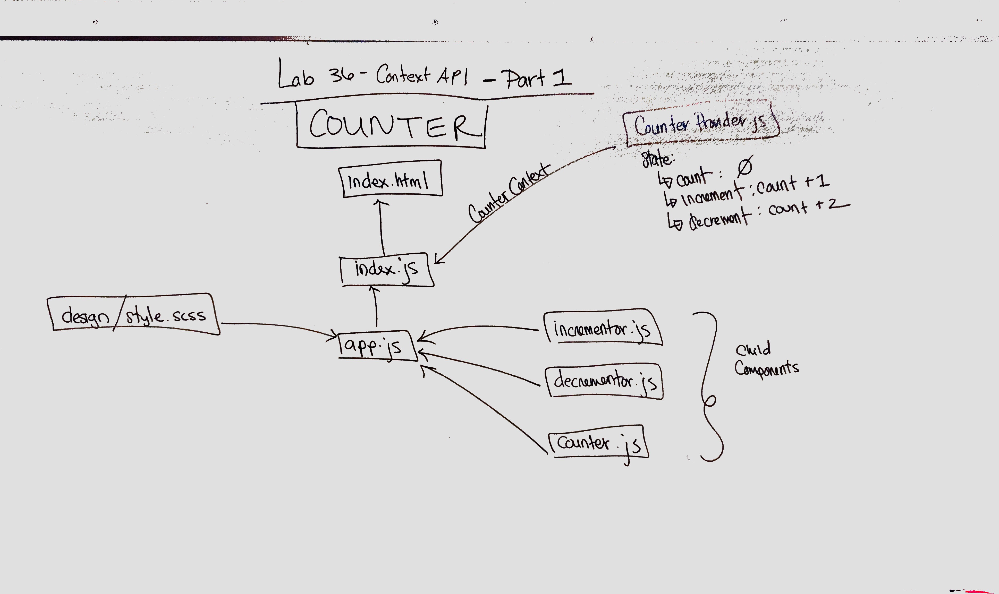
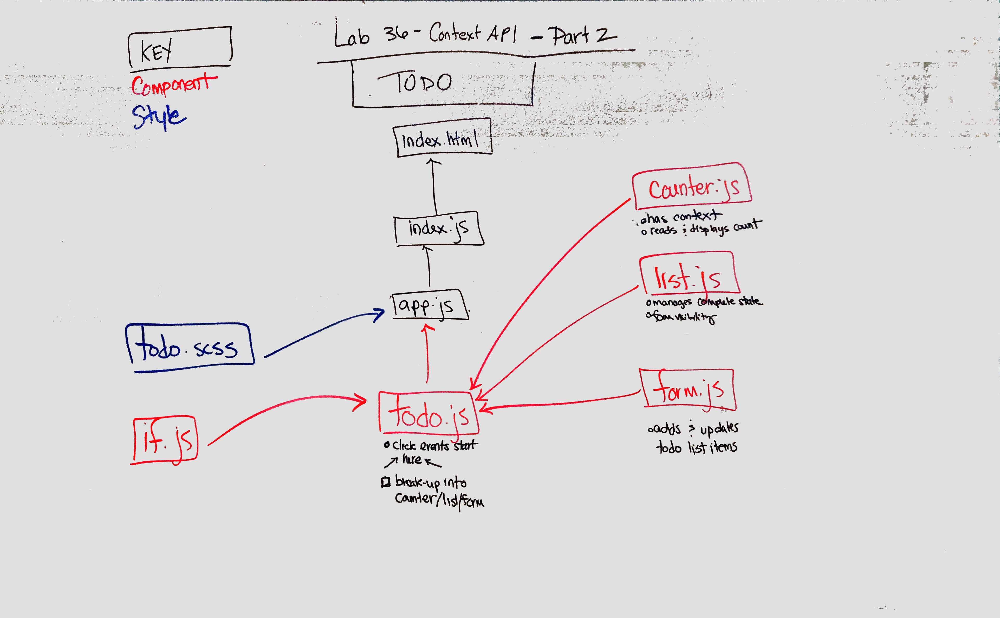

 LAB
=================================================

## Context API
### Author: Erin Trainor

_Note_: I linked 2 code sandbox links. The first was my first attempt at assignment 1 but I realized I was spending too much time just re-creating the counter before actually getting to the context component. Late evening I restarted by forking a previous lab that included a counter. I intend to apply the context component to the forked code.

### Description
*Assignment 1 - Counter*
- [ ] Create a Counter Provider component, which exposes the following state:
* count - A number (default to 0)
* increment - A reference to a function that increases the count
* decrement - A reference to a function that decreases the count
- [ ] In the index.js, import CounterContext and wrap <App /> in it, so that all child components can optionally subscribe to it as consumers.
- [ ] Your <App /> component should simply pull in and render the following child components …
- [ ] Create the following child components that register as a .Consumer to the provided context.
* <Incrementer /> - Renders a button that, when clicked, calls the increment() method in the Counter Provider
* <Decrementer /> - Renders a button that, when clicked, calls the decrement() method in the Counter Provider
* <Counter /> - Renders the current value of count from the Counter Provider
- [X] Provide good styling. Use the css-in-js methodology within the components themselves.

*Assignment 2 - To Do*
You have been provided, in the starter-code folder, a working To Do manager application, written using standard React Component State

- [ ] Refactor the app to make use of Context
- [ ] Create a context for the Application
- [ ] Create a separate <Counter /> component that reads and displays the count from Context
- [ ] Create separate components for the main To App elements
* form - Adds and updates to do list items
* list - Lists items, manages complete state and form visibility

### Links, Resources and Documentation
* [PR](https://github.com/401-advanced-javascript-401d29/lab-34/pull/1)
* [Code Sandbox - Initial Attempt](https://codesandbox.io/s/3yw5vzvqmm)
* [Code Sandbox - Second Attempt](https://codesandbox.io/s/99kkqv82p)

#### UML

